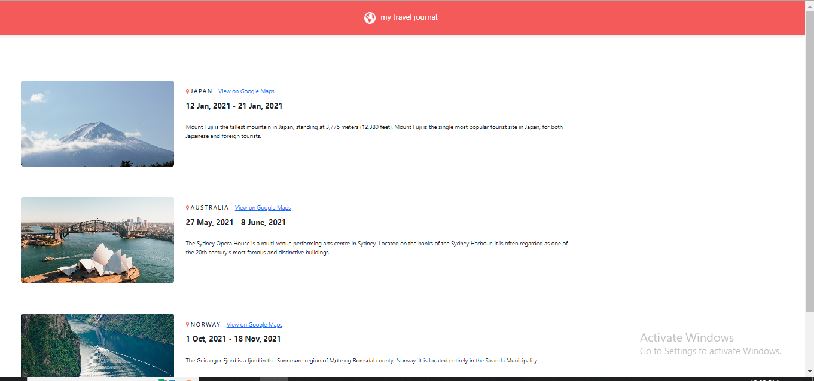

# MY TRAVEL JOURNAL

## problem / solution

If you're copy-pasting code from Bootstrap and encountering a linting warning related to the style prop in React, it's possible that there's a discrepancy between the expected format of the style prop in React and the format of the Bootstrap code you're pasting.
instead of this 

## Learn More

You can learn more in the [Create React App documentation](https://facebook.github.io/create-react-app/docs/getting-started).

To learn React, check out the [React documentation](https://reactjs.org/).
